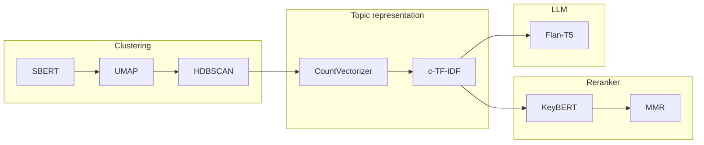

# 텍스트 클러스터링과 토픽 모델링

- 텍스트 클러스터링: 텍스트를 내용, 의미, 관계를 기반으로 비슷한 그룹으로 모으는 것
- 구조적이지 않은 대용량 데이터를 분류 가능, 탐색적 데이터 분석을 빠르게 수행 가능
- 레이블이 없어도 콘텐츠 의미를 기반으로 텍스트를 그룹화할 수 있음
- 레이블 할당, 잘못 분류된 데이터 찾기, 이상치 찾기에 활용 가능

- 다양한 종류의 언어 모델을 결합하는데 창의적인 방법을 사용할 수 있다는 것을 파악하는 것이 중요

## 아카이브 논문: 계산과 언어

- CS, 수학, 물리학 분야 학술 논문 데이터의 제목과 요약 사용

```jupyterpython
from datasets import load_dataset

dataset = load_dataset("maartengr/arxiv_nip")["train"]

abstracts = dataset["Abstracts"]
titles = dataset["Titles"]
```

## 텍스트 클러스터링 파이프라인

- 텍스트 클러스터링으로 분류 작업 + 탐색적 데이터 분석 통한 작업 복잡도 파악 가능
- 일반적으로 임베딩 모델 - 차원 축소 모델 - 클러스터링 모델 3단계로 구성

### 문서 임베딩

- 텍스트를 임베딩으로 변환
- 의미 유사도 작업에 최적화된 모델 사용

```jupyterpython
from sentence_transformers import SentenceTransformer

embedding_model = SentenceTransformer("thenlper/gte-small")
embeddings = embedding_model.encode(abstracts)
```

```jupyterpython
embeddings.shape
```

### 임베딩 차원 축소

- 차원 수가 증가하면 가능한 값 개수가 지수적으로 증가 -> 의미 있는 클러스터 찾기 매우 어려움
- 고차원 데이터 전역 구조를 보존하는 저차원 표현을 찾아 변환 - 정보 손실 발생
- PCA: 주성분 분석
	- 데이터를 하나의 축으로 사상시켰을 때 분산이 큰 축을 순서로 새로운 좌표계에 데이터를 선형 변환함
- UMAP: 균일 다양체 근사 및 투영을 통한 차원 축소
	- 가장 유사한 퍼지 위상 구조를 갖는 다양체를 모델링함
	- 고차원 공간에서 n번째 까까운 점까지 거리를 바탕으로 그래프를 생성하고 저차원 공간에서는 얼마나 가까운 거리로 묶을지 설정할 수 있다.

```jupyterpython
from umap import UMAP

umap_model = UMAP(
    n_components=5,
    min_dist=0.0,
    metric="cosine"
)

reduced_embeddings = umap_model.fit_transform(embeddings)
```

### 임베딩 클러스터링

- 센트로이드 기반 알고리즘
	- 직접 클러스터 개수 지정 필요
	- 모든 데이터가 각 클러스터로 할당
- 밀도 기반 알고리즘
	- 알고리즘이 클러스터 개수를 결정
	- 이상치는 클러스터에 할당되지 않음

```jupyterpython
from hdbscan import HDBSCAN

hdbscan_model = HDBSCAN(
    min_cluster_size=50,
).fit(reduced_embeddings)

clusters = hdbscan_model.labels_
len(set(clusters))
```

### 클러스터 조사

- 첫번째 클러스터 확인

```jupyterpython
import numpy as np

for index in np.where(clusters == 0)[0][:3]:
    print(abstracts[index][:300] + "... \n")
```

- 임베딩을 2차원으로 축소하여 시각화
- 차원 축소는 정보 손실을 동반하므로 분석자가 직접 평가하는 과정 필요

```jupyterpython
import pandas as pd

reduced_embeddings = UMAP(
    n_components=2,
    min_dist=0.0,
    metric="cosine"
).fit_transform(embeddings)

df = pd.DataFrame(reduced_embeddings, columns=["x", "y"])
df["title"] = titles
df["cluster"] = [str(c) for c in clusters]

clusters_df = df.loc[df.cluster != "-1", :]
outliners_df = df.loc[df.cluster == "-1", :]
```

```jupyterpython
import matplotlib.pyplot as plt

plt.scatter(
    outliners_df.x,
    outliners_df.y,
    alpha=0.05,
    c="lightgrey",
    s=2,
)
plt.scatter(
    clusters_df.x,
    clusters_df.y,
    alpha=0.6,
    c=clusters_df.cluster.astype(int),
    s=2,
    cmap="tab20b",
)
plt.axis("off")
```

## 토픽 모델링

- 토픽 모델링: 텍스트 데이터 집합에서 주제나 잠재적인 토픽을 찾는 것, 토픽의 의미를 잘 나타내는 키워드 찾을 수 있음

### BERTopic: 모듈화된 토픽 모델링 프레임워크

- 의미적으로 유사한 텍스트 클러스터를 활용하여 토픽 표현을 추출하는 토픽 모델링 기법
- 텍스트 클러스터링과 동일한 과정 수행 후 BoW 방식으로 어휘사전에 있는 단어의 분포 모델링
- 자주 사용하는 단어 추출 가능

- BoW 방식을 그냥 적용하면 문제가 있음

1. 클러스터 수준 분석이 필요한데 문서 수준 표현됨 -> 클러스터 기준으로 계산
2. 문서에 자주 등장하지만 실제로는 의미가 없는 I, the 같은 불용어 제거 필요 -> 클러스터 별 등장 빈도에 따라 가중치 부여
	- c-TF-IDF: 클래스 기반-용어 빈도-역문서 빈도, 빈도(c-TF)에 단어별 가중치(IDF) 곱하여 계산

```jupyterpython
!pip install bertopic
from bertopic import BERTopic

topic_model = BERTopic(
    embedding_model=embedding_model,
    umap_model=umap_model,
    hdbscan_model=hdbscan_model,
    verbose=True
).fit(abstracts, embeddings)
```

```jupyterpython
topic_model.get_topic_info()
```

```jupyterpython
topic_model.get_topic(0)
```

```jupyterpython
topic_model.find_topics("topic modeling")
```

```jupyterpython
topic_model.get_topic(22)
# 위 결과에서 확률 가장 높은 항목으로 숫자 교체 
```

```jupyterpython
topic_model.topics_[titles.index("BERTopic: Neural topic modeling with a class-based TF-IDF procedure")]
```

```jupyterpython
fig = topic_model.visualize_documents(
    titles,
    reduced_embeddings=reduced_embeddings,
    width=1200,
    hide_annotations=True,
)
fig.update_layout(font=dict(size=16))
```

```jupyterpython
topic_model.visualize_barchart()
```

```jupyterpython
topic_model.visualize_heatmap(n_clusters=30)
```

```jupyterpython
topic_model.visualize_hierarchy()
```

### 특수 블록 추가

- BoW는 속도는 빠르지만 의미론적 구조가 반영되어 있지 않음
- 리랭커 모델으로 단어 순위 재조정하여 표현 개선(미세 튜닝)

```jupyterpython
from copy import deepcopy

original_topics = deepcopy(topic_model.topic_representations_)
```

```jupyterpython
def topic_differences(model, original_topics, nr_topics=5):
    df = pd.DataFrame(columns=["Topic", "Original", "Reranked"])
    for topic in range(nr_topics):
        old_words = " | ".join(list(zip(*original_topics[topic]))[0][:5])
        new_words = " | ".join(list(zip(*model.topic_representations_[topic]))[0][:5])
        df.loc[len(df)] = [topic, old_words, new_words]
    return df
```

- KeyBERTInspired
    - 문서와 토픽의 c-TF-IDF 값 간의 유사도를 계산하여 토픽별 대표 문서 추출
    - 불용어 제거
    - 업데이트된 결과는 이해하기 쉽지만 nmt 같은 모델이 표현할 수 없는 단어가 제거되는 단점도 있음
    - summaries, summary는 하나로 합쳐지지 않음

```jupyterpython
from bertopic.representation import KeyBERTInspired

representation_model = KeyBERTInspired()
topic_model.update_topics(abstracts, representation_model=representation_model)

topic_differences(topic_model, original_topics)
```

- MMR
  - 비교하려는 문서와 관련 있지만 서로 다른 키워드 집합 발견
  - 후보 키워드를 임베딩하고 반복적으로 다음 키워드 계산해 추가
  - 중복된 단어는 제거하고 새로운 단어만 유지

```jupyterpython
from bertopic.representation import MaximalMarginalRelevance

representation_model = MaximalMarginalRelevance(diversity=0.2)
topic_model.update_topics(abstracts, representation_model=representation_model)

topic_differences(topic_model, original_topics)
```
### 텍스트 생성 블록 추가

- 생성형 모델로 토픽 레이블을 생성하는 것도 한 방법
- 키워드 생성, 순위 재조정 대신 대표 문서 기반으로 짧은 레이블 생성
- 토픽마다 생성 모델 한 번만 사용

```jupyterpython
from transformers import pipeline
from bertopic.representation import TextGeneration

prompt = """I have topics that contains the following documents:
[DOCUMENTS]

The topic is described by the following keywords: [KEYWORDS]

Based on the documents and keywords, what is this topic about?"""

generator = pipeline("text2text-generation", model="google/flan-t5-base")
representation_model = TextGeneration(
	generator,
	prompt=prompt,
	doc_length = 50,
	tokenizer="whitespace",
)
topic_model.update_topics(abstracts, representation_model=representation_model)

topic_differences(topic_model, original_topics)
```


```jupyterpython
fig = topic_model.visualize_document_datamap(
    titles,
    topics=list(range(20)),
    reduced_embeddings=reduced_embeddings,
    width=1200,
    datamap_kwds={
        "label_wrap_width": 20,
        "use_medoids": True,
        "label_font_size": 12,
    }
)
```

### BERTopic 파이프라인

- 클러스터링과 토픽 두 단게를 합쳐 BERTopic 파이프라인 구성
- 특수 블록, 텍스트 생성 블록 추가하여 키워드 추출/라벨 생성



- 각 단계가 서로 독립적이라 모듈화 가능하고 필요한 모델을 교체, 추가하여 사용할 수 있는 구조
- 예를 들어, 다음과 같이 모델을 바꿀 수 있음
	- 임베딩 모델: SBERT, BoW, Flair, Spacy, Gensim, TensorFlow Hub, HuggingFace, Model2Vec
	- 차원 축소 모델: PCA, UMAP, TruncatedSVD
	- 클러스터링 모델: HDBSCAN, k-Means
